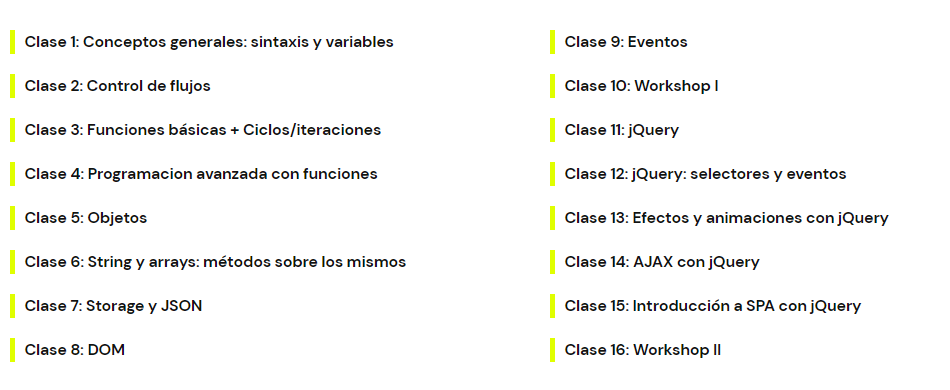
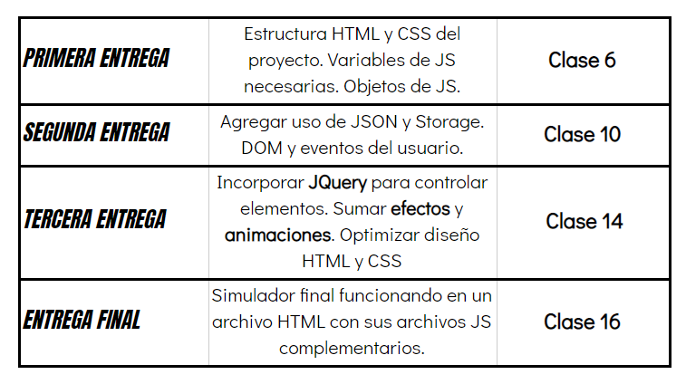

JusTravel
===

Web de agencia de viajes que ofrece diversos tours con hospedaje y permite cotizar un viaje al destino que más nos interese

Tecnologías usadas

1. Javascript ES6
2. Jquery
3. NodeJS
4. Ajax
5. Firebase
6. CSS/SASS
7. Bootstrap v4

Programa del curso
===

Cronograma de Entregas
===

Demo
===

[Github Pages](https://torrescereno.github.io/js-coder-tour-app/) v1